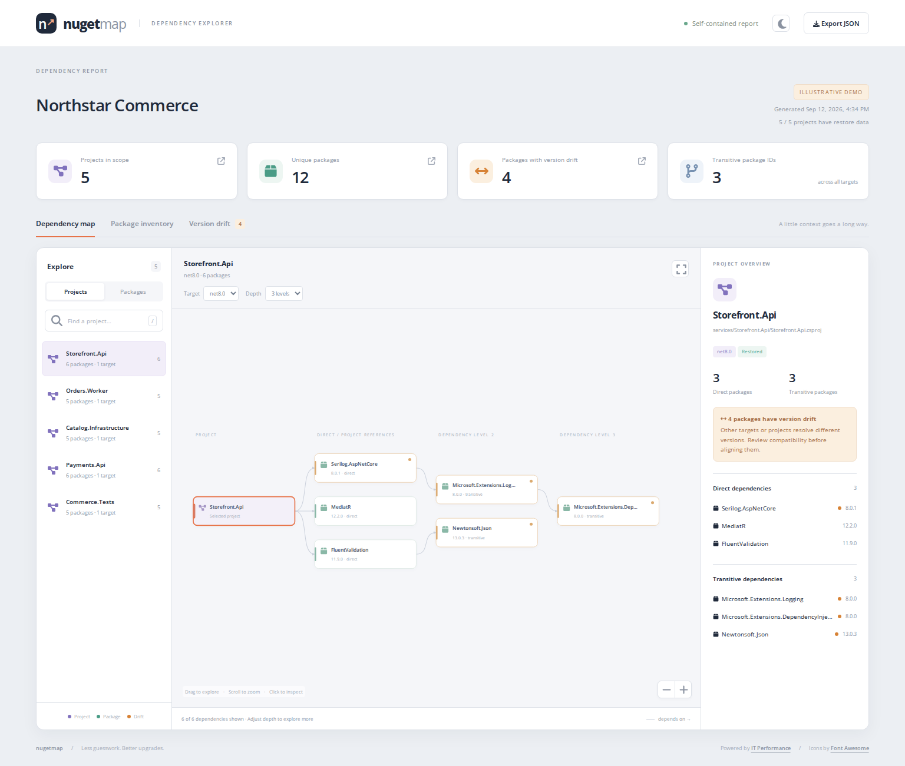
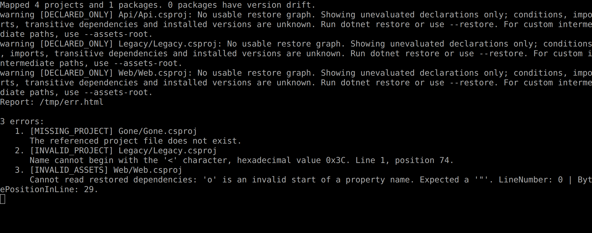
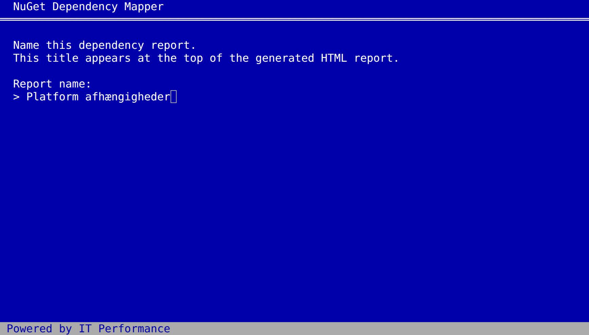
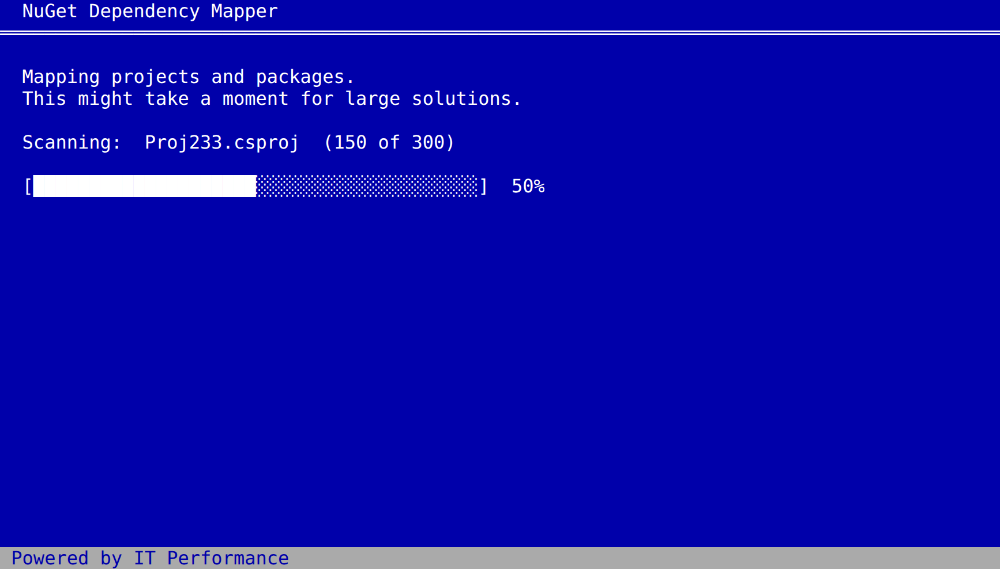
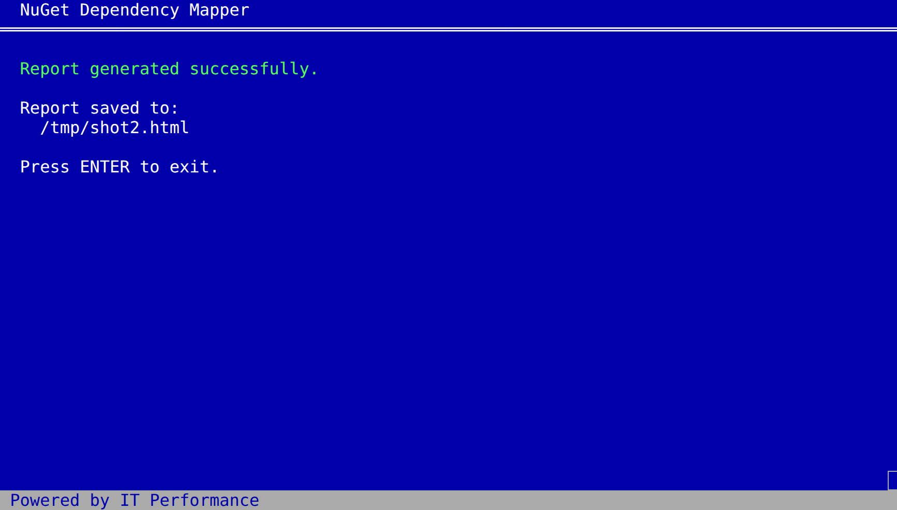

# NuGet Map

Et .NET CLI-værktøj, der giver overblik over NuGet-afhængigheder i en solution, et projekt eller en mappe. Rapporten er én interaktiv HTML-fil, der kan åbnes direkte i browseren og deles uden server, CDN eller internetforbindelse.

Rapporten bruger Open Sans, indlejret direkte i HTML-filen. Fonten og dens SIL Open Font License følger med værktøjet; browseren behøver ikke hente fonts fra nettet. Fontens kilde og licens findes i [Report/Fonts](src/NugetDependencyMapper/Report/Fonts/README.md).

```bash
dotnet nuget-map ./MySolution.sln --restore --open
```



Skærmbilledet viser rapporten kørt på illustrative demo-data (`--demo`); dine egne pakkenavne, versioner og projekter vises i stedet.

## Prøv det fra kildekoden

Bygning kræver .NET SDK 10.0.100 eller nyere 10.0 SDK. Det pakkede værktøj bruger .NET 10 runtime. Repositoryets `global.json` vælger en installeret 10.0 SDK.

```bash
# Lav en interaktiv demo med tydeligt mærkede, syntetiske data
dotnet run --project src/NugetDependencyMapper -- --demo --name "Northstar Commerce" -o artifacts/nuget-map-demo.html --open

# Analysér et rigtigt repository
dotnet run --project src/NugetDependencyMapper -- /sti/til/repository --restore -o artifacts/report.html --open
```

Demoens pakkeversioner og forbindelser er illustrative og skal ikke bruges som oplysninger om de virkelige pakker.

## Installér som dotnet-værktøj

Når pakken er publiceret på NuGet.org (se [Udgivelse](#udgivelse)):

```bash
dotnet tool install --global NugetDependencyMapper
dotnet nuget-map ./MySolution.sln --restore --open
```

Indtil da, eller for at teste en lokal build, byg og installér den lokalt:

```bash
dotnet pack src/NugetDependencyMapper -c Release -o artifacts
dotnet tool install --global NugetDependencyMapper --add-source ./artifacts
dotnet nuget-map ./MySolution.sln --restore --open
```

Den globale .NET tools-mappe skal være på `PATH`. Kommandoen hedder `dotnet-nuget-map`, hvilket også gør det muligt at kalde den som `dotnet nuget-map`.

Man kan alternativt installere i en lokal mappe:

```bash
dotnet tool install NugetDependencyMapper --tool-path .tools --add-source ./artifacts
./.tools/dotnet-nuget-map . --open
```

På Windows bruges `.\.tools\dotnet-nuget-map.exe`. Tilføj `.tools` til `PATH`, hvis du vil bruge `dotnet nuget-map` med denne installation.

## Det kan rapporten

- **Projekt → pakker:** Vælg et projekt og se direkte og transitive referencer pr. framework/runtime.
- **Pakke → projekter:** Vælg en pakke, og midtergrafen skifter til at vise alle projekter, der er afhængige af den, med version pr. projekt. Listen kan eksporteres til CSV (projektnavn og version).
- **Namespace-filter:** Skjul pakker efter præfiks (fx `Microsoft`, `System`) i grafen, pakkeoversigten, versionsforskelle og tallene øverst i rapporten. Filteret huskes i browserens `localStorage`.
- **Versionsforskelle:** Pakker med flere gendannede versioner markeres i grafen og samles i en tabel sorteret efter antal berørte projekter.
- **Afhængighedskæder:** “Why is it here?” viser veje fra projektet gennem pakker og projektreferencer til den valgte pakke.
- **Navigation:** Søgning, klikbare grafnoder, zoom, panorering, dybdevalg og framework/runtime-vælger. Grafnoder kan aktiveres med Enter eller mellemrum; `/` fokuserer søgefeltet.
- **Lyst/mørkt tema:** Følger systemets præference som standard. Måne-/sol-ikonet i toppen skifter manuelt og huskes i browserens `localStorage` ved genbesøg af samme rapportfil.
- **Eksport og CI:** Download JSON fra HTML-siden, eller skriv JSON fra CLI. Lad CI reagere på versionsforskelle og ufuldstændig analyse via exitkoder.
- **Licenser:** Se udgiverens deklarerede licens pr. gendannet pakkeversion i oversigten og pakkedetaljerne. Filtrér efter licensudtryk, licensfil, ældre licenslink, ukendte oplysninger eller krav om licensaccept. Søgefeltet i pakkeoversigten kan også finde licensudtryk som `MIT`.
- **Analysebemærkninger:** Manglende eller forældet restore, ugyldige filer, mislykkede restores og NuGet-diagnostik vises i rapporten og terminalen. Fejl (fx en mislykket restore) folder analysebemærkningerne automatisk ud og markeres rødt, så de er synlige uden et ekstra klik.

## Kommandoer

Ved interaktiv kørsel spørger værktøjet efter rapportens navn direkte i fuldskærmsvisningen med `Report name:`. Navnet bruges som overskrift i HTML-rapporten, i browserfanen og i JSON-data. Tomme svar udløser spørgsmålet igen. Angiv `--name`, hvis navnet allerede er kendt, eller ved automatiseret kørsel uden terminal:

```bash
dotnet nuget-map ./src --name "Platformens NuGet-afhængigheder" -o artifacts/map.html
```

`--name` angiver rapportens titel. Filnavnet vælges fortsat med `--output`/`-o` og er som standard `nuget-map.html`. Uden en interaktiv terminal kræves `--name`, så en CI-kørsel ikke venter på et svar.

```bash
dotnet nuget-map                           # Scan den aktuelle mappe
dotnet nuget-map ./Product.sln             # Solution-medlemmer og projektreferencer
dotnet nuget-map ./Product.slnx            # XML solution-format
dotnet nuget-map ./src/Api/Api.csproj       # Ét projekt og dets projektreferencer
dotnet nuget-map ./src --restore           # Gendan før analysen
dotnet nuget-map ./src --restore --continue-on-restore-error  # Fortsæt selvom et projekt fejler
dotnet nuget-map . -o artifacts/map.html --json artifacts/map.json
dotnet nuget-map . --assets-root ./artifacts/obj
dotnet nuget-map . --fail-on-drift --fail-on-incomplete
dotnet nuget-map --help
```

`--restore` kører `dotnet restore` og bruger projektets normale NuGet-konfiguration. Private feeds skal være konfigureret i miljøet på forhånd. En mislykket restore stopper kørslen som standard, så der ikke fremstilles en ny rapport med gamle data. Tilføj `--continue-on-restore-error`, hvis rapporten i stedet skal dække så mange projekter som muligt: en fejlet restore springes over, og analysen fortsætter med de øvrige projekter, mens det fejlede projekt vises med sine sædvanlige mangeldiagnostikker (fx `DECLARED_ONLY`, `MISSING_PROJECT`) i rapporten. Det gælder også en `<ProjectReference>` til et flyttet eller slettet projekt, hvor selve mappen ikke længere findes. Uden `--restore` foretager analysatoren hverken netværkskald eller MSBuild-evaluering.

| Exitkode | Betydning |
| --- | --- |
| `0` | Rapport genereret |
| `1` | Ugyldigt input, læse-/skrivefejl eller restore fejlede |
| `2` | `--fail-on-drift` og flere gendannede versioner af samme pakke |
| `3` | `--fail-on-incomplete` og manglende restore-data eller analysebemærkninger på fejlniveau |

HTML/JSON bliver stadig skrevet ved kode `2` og `3`. Kode `3` har prioritet over `2`. Eksisterende rapportfiler på de valgte outputstier overskrives.

Analysebemærkninger har to niveauer. **Fejl** betyder, at rapporten mangler data, den burde have haft: `MISSING_PROJECT`, `INVALID_ASSETS`, `INVALID_PROJECT`, `RESTORE_FAILED` og NuGet-logposter med `level: Error`. **Advarsler** er oplysende: `STALE_RESTORE`, `DECLARED_ONLY`, `TARGET_METADATA`, `UNRESOLVED_EDGE`, `LEGACY_PACKAGES` og NuGets egne advarsler som `NU1603` og `NU1701`. `--fail-on-incomplete` udløses af fejl og af projekter uden restore-data — ikke af advarsler alene, så et almindeligt repository med et par NuGet-advarsler kan stadig køre grønt i CI. Begge niveauer vises i rapporten, hvor fejl markeres rødt og folder analysebemærkningerne ud automatisk.

I terminalen skrives advarsler løbende med præfikset `warning`, mens **fejl samles i en nummereret liste allersidst** — efter opsummeringen, advarslerne og stien til rapporten. En parsefejl i én projektfil kan dermed ikke drukne i en skærmfuld advarsler fra en stor scanning. Et fatalt nedbrud vises i samme liste, så den sidste udskrift altid er det, der gik galt. Listen skrives til stderr:



Fuldskærmsvisningens slutskærm viser samtidig antallet med rød overskrift (`Report generated with 3 errors.`) i stedet for at melde alt vel.

I en interaktiv terminal skifter værktøjet midlertidigt til en fuldskærmsvisning i klassisk Windows XP-installations-stil: en blå skærm med titellinje, et skærmbillede hvor rapportens navn indtastes (medmindre `--name` er angivet), en "Scanning:"-fremgangslinje mens projekter og pakker analyseres, en tilsvarende fremgangslinje pr. projekt under `--restore`, og til sidst en statusskærm med detaljer. Bundlinjen viser altid "Powered by IT Performance". Skærmen bliver stående — også ved fejl — indtil der trykkes Enter; først da vender terminalen tilbage til normal visning med de sædvanlige linjer (`Mapped …`, `Report: …`, fejlbeskeder) i scrollback. Det er ren pynt og slås automatisk fra, når vinduet er mindre end 40×12, når output eller input omdirigeres (fx i CI/scripts), eller når `NO_COLOR` eller `NUGET_MAP_PLAIN=1` er sat — så scripts og logs er upåvirkede og venter aldrig på et tastetryk. Sæt `NUGET_MAP_PLAIN=1`, hvis du vil have almindeligt linjeoutput i en interaktiv terminal. Fuldskærmsvisningen tegner aldrig bredere eller højere end vinduet og følger med, hvis du ændrer størrelsen undervejs; bliver vinduet for lille, gives terminalen tilbage, og kørslen fortsætter med almindelige linjer.

Skærmen hvor rapportens navn indtastes:



Fremgangslinjen under analysen, og statusskærmen til sidst:





## Datagrundlag og afgrænsninger

### Licensoplysninger

Licenser læses offline fra den konkrete pakkeversions `.nuspec` i NuGet-cachen, via `libraries` og `packageFolders` i restore-data. Et SPDX-udtryk som `MIT` eller `MIT OR Apache-2.0` bevares uændret og får et link til licensudtrykket. Et `license`-element med typen `file` vises med filnavnet og en markering om at gennemgå filen i pakken; filindholdet indlejres ikke. Det ældre `licenseUrl` vises som link, når der ikke er et moderne licensfelt. Links åbnes kun ved klik.

Manglende, ugyldige eller utilgængelige metadata vises som **Unknown**, og deklarationer uden restore får ingen gættet licens. Det påvirker ikke afhængighedsgrafens restore-status eller `--fail-on-incomplete`. Licensoplysninger indgår i JSON-eksporten, og forskellige metadata for forskellige versioner holdes adskilt. Licensfiler, ældre links og ukendte oplysninger markeres med ravfarvede mærker; licensudtryk får et neutralt lilla mærke. `requireLicenseAcceptance` vises særskilt, når udgiveren har sat feltet.

Markeringerne gengiver pakkens metadata; de afgør ikke, om en bestemt anvendelse er tilladt, eller om licensen er godkendt i organisationen. Demoens licensdata er illustrative. Datamodellen følger [NuGets dokumentation for licensmetadata](https://learn.microsoft.com/en-us/nuget/reference/nuspec#license).

### Mapper med mange repositories

En scanning af eksempelvis `/repos` finder projekter rekursivt i undermapperne og samler dem i **én rapport**, også når de tilhører forskellige solutions. Mappescanningen læser projektfilerne direkte og begrænser sig ikke til solution-medlemskab. Projekter med samme navn er adskilte via deres relative sti. Pakker samles på tværs af hele scanningen, så versionsforskelle mellem ellers uafhængige repositories også markeres.

Med `--restore` køres restore sekventielt fra hvert projekts egen mappe, så dets `global.json` og normale projektkonfiguration bliver brugt. Store scanninger kan derfor tage tid; en restore-fejl stopper kørslen, medmindre `--continue-on-restore-error` er angivet, så et enkelt fejlende repository ikke blokerer resten af en stor scanning. Uden `--restore` bruges eksisterende restore-data, og manglende data markeres som hidtil. Rapportens filstørrelse vokser med antallet af projekter og targets; den aktuelle version viser højst 120 grafnoder ad gangen, men alle pakker er med i oversigten og JSON-eksporten. Der er ikke automatisk opdeling i én rapport pr. repository. Angiv et enkelt repository eller en solution, hvis sammenligningen skal afgrænses.

### Afhængighedsgraf

Analysen læser `obj/project.assets.json`, som indeholder NuGets valgte pakkeversioner og dependency graph fra seneste restore. Dermed kommer Central Package Management, transitive afhængigheder, betingelser og imports med, som de blev gendannet. Hvert target/framework/runtime har sin egen graf; der opfindes ikke kæder ved at kombinere forskellige targets.

Pakkernes identitet sammenlignes uden forskel på store/små bogstaver. Versionsforskelle er et signal om noget, der bør undersøges, og er ikke i sig selv bevis på inkompatibilitet. Krav som `[1.0, 2.0)` holdes adskilt fra faktisk gendannede versioner.

Hvis restore-data mangler, læses `PackageReference`, `VersionOverride` og den nærmeste `Directory.Packages.props` som **uevaluerede deklarationer**. Betingelser, imports og MSBuild-egenskaber evalueres ikke i denne tilstand. Deklarationerne tæller ikke som installerede versioner og kan ikke danne pålidelige afhængighedskæder. `packages.config` vises ligeledes med begrænset information.

Projektopdagelsen understøtter `.csproj`, `.fsproj`, `.vbproj`, `.sln` og `.slnx` samt bogstavelige `ProjectReference`-stier. Den springer `bin`, `obj`, `.git`, `.vs`, `node_modules`, `artifacts`, `.tools` og symbolske undermappelinks over. Dynamiske eller importerede projektreferencer udvides ikke til selvstændige projektposter; pakker arvet gennem dem kan stadig fremgå af restore-grafen. Betingede, bogstavelige projektreferencer medtages konservativt.

Bruger et repository en anden intermediær mappe, angives `--assets-root`. Assets-filer matches på `project.restore.projectPath`; flere filer for samme projekt afvises som tvetydige. Assets-filer med flyttede/udenlandske projektstier kræver en ny restore.

Projektfilen og almindelige overordnede build-/pakkefiler sammenlignes med restore-filens tidsstempel. Det er en hjælp til at opdage gamle data, ikke et komplet friskhedstjek af alle importerede filer; brug `--restore`, når rapporten skal afspejle den aktuelle konfiguration.

For at holde grafen håndterbar vises højst 120 noder ad gangen. Pakkeoversigten indeholder fortsat alle pakker. Kædevisningen har en tydelig grænse på 12 stier, 24 niveauer og 4.000 undersøgte stier og håndterer cykler. JSON-eksporten indeholder hele den analyserede graf. Rapporten indeholder projektnavne og filstier fra analysen.

## Validering

Projektet har ingen eksterne NuGet-afhængigheder. Testprogrammet bruger isolerede fixtures og kan køres uden et eksternt testframework:

```bash
dotnet build NugetDependencyMapper.sln -c Release
dotnet run --project tests/NugetDependencyMapper.Tests
dotnet pack src/NugetDependencyMapper -c Release -o artifacts
```

Browser-smoketesten kræver Node.js samt Playwright; det er udviklingsværktøjer og bliver ikke en del af HTML-rapporten. Den kører også i CI og lægger skærmbillederne op som build-artifact:

```bash
dotnet run --project src/NugetDependencyMapper -- --demo --name "Northstar Commerce" -o artifacts/nuget-map-demo.html
dotnet run --project src/NugetDependencyMapper -- tests/browser/fixture --name "Diagnostics fixture" -o artifacts/nuget-map-diagnostics.html
npm install --prefix tests/browser
npx --prefix tests/browser playwright install chromium
node tests/browser/smoke.cjs
```

Den anden rapport bygges på `tests/browser/fixture`, et projekt der bevidst ikke kan gendannes, så testen dækker både fejl- og advarselsniveau i analysebemærkningerne. Testen fejler, hvis rapporten laver ét eneste netværkskald — det er værnet om, at rapporten forbliver offline.

## Udgivelse

Et push af et tag i formatet `vX.Y.Z` udløser [.github/workflows/release.yml](.github/workflows/release.yml), som bygger, tester, pakker og publicerer pakken til NuGet.org samt vedhæfter `.nupkg`-filen til et GitHub Release. Workflowet kræver et repository-secret `NUGET_API_KEY` med en API-nøgle fra [nuget.org](https://www.nuget.org/account/apikeys) (scope: "Push new packages and package versions", pattern `NugetDependencyMapper`).

```bash
# Sæt <Version> i src/NugetDependencyMapper/NugetDependencyMapper.csproj til X.Y.Z først
git tag vX.Y.Z
git push origin vX.Y.Z
```

Workflowet afviser et tag, der ikke matcher `<Version>` i csproj-filen, så en glemt version-bump ikke stille publicerer den forrige version. `--version` læser samme nummer fra assemblyen.

Hvert push til `main` kører desuden [.github/workflows/ci.yml](.github/workflows/ci.yml) (build, test, pack-verifikation) uden at publicere noget.

## Oplagte næste udvidelser

1. **Sikkerheds- og deprecation-oplysninger:** Hent advisory-data fra de konfigurerede feeds og vis også transitive risici med de projekter, der bliver berørt.
2. **Baseline-sammenligning:** Sammenlign to JSON-rapporter og vis tilføjede, fjernede og ændrede pakker i en pull request.
3. **Opgraderingsplan:** Gruppér relaterede pakker og identificér de direkte referencer, der skal ændres for at opgradere en transitiv pakke.
4. **Fælles versionspolitik:** Understøt tilladte versionsintervaller, dokumenterede undtagelser og forslag til `Directory.Packages.props`.
5. **Repository-ejerskab:** Knyt berørte projekter til teams, så store opgraderinger kan koordineres.

Disse udvidelser er forslag; denne version ændrer ikke projektfiler eller slår seneste pakkeversioner og sikkerhedsdata op.

Teknisk baggrund: [Microsofts dokumentation om .NET tools](https://learn.microsoft.com/en-us/dotnet/core/tools/global-tools) og [NuGets dependency resolution](https://learn.microsoft.com/en-us/nuget/concepts/dependency-resolution).
